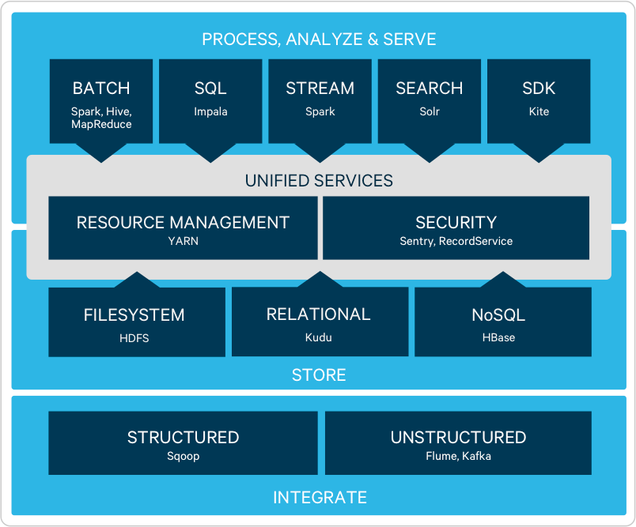

## Welcome to Data Architecture & MLOps 

### Project organisation

- [Projektvorstellung](https://github.com/kirenz/data-architecture-mlops/blob/main/slides/project.pdf)

- [Projekt-Bewertung](https://github.com/kirenz/data-architecture-mlops/blob/main/slides/orga_intro.pdf)

- [Projekt-Dokumentation](https://github.com/kirenz/data-architecture-mlops/blob/main/slides/orga_doku.pdf)

- [Hinweise zur Recherche](https://github.com/kirenz/data-architecture-mlops/blob/main/slides/orga_recherche.pdf)

- [**Anleitung zu Erstellung eines Jupyter Books (für die Dokumentation bei GitHub)**](https://kirenz.github.io/codelabs/codelabs/jupyter-book/#0))

---

### Slides

- [Introduction to MLOps](https://github.com/kirenz/data-architecture-mlops/blob/main/slides/mlops_feature_stores_mlflow_kubeflow.pdf)

- [Usage of Pipelines in the ML Lifecycle with TFX and Kubeflow](https://github.com/kirenz/data-architecture-mlops/blob/main/slides/pipelines_tfx_kubeflow.pdf)

---

### Tutorials

*Concept of Data Lakehouse*

- [Inmon, B., Levins, M. & Srivastava, R. (2021). Building the Data Lakehouse. Technics Publications, NY.](https://drive.google.com/file/d/1bURUyz-zSSCdT_k-MNjuFO0Gbq4vDkvt/view?usp=sharing)

- [Inmon, B. & Levins, M. (2021). Evolution to the Data Lakehouse. Databricks Blog.](https://databricks.com/de/blog/2021/05/19/evolution-to-the-data-lakehouse.html)

- Open Source Data Lakehouse solutions: 
  - [Delta Lake](https://delta.io) (provided by Databricks)
  - [Apache Hudi](https://hudi.apache.org) (provided by Uber)
  - [Apache Iceberg](https://iceberg.apache.org) (provided by Netflix)

*Delta Lake*

The Delta Lake is the recommended technology in this course.

- 💻 [Delta Lake Installation tutorial (with PySpark 3.1.2.)](https://github.com/kirenz/deltalake)

- [Natively Query Your Delta Lake With Scala, Java, and Python (Tutorial)](https://databricks.com/de/blog/2020/12/22/natively-query-your-delta-lake-with-scala-java-and-python.html)

- [A native library for Delta Lake - Python installation guide](https://delta-io.github.io/delta-rs/python/)

- [Armbrust, M., Ghodsi, A., Xin, R. & Zaharia, M. (2021). Lakehouse: A New Generation of Open Platforms that Unify Data Warehousing and Advanced Analytics. 11th Annual Conference on Innovative Data Systems Research (CIDR ’21), January 11–15, 2021](https://databricks.com/de/wp-content/uploads/2020/12/cidr_lakehouse.pdf)

*Hadoop Ecosystem*

Hadoop is an ecosystem of open source components that fundamentally changes the way enterprises store, process, and analyze data. Unlike traditional systems, Hadoop enables multiple types of analytic workloads to run on the same data, at the same time, at massive scale on industry-standard hardware (source: [Cloudera](https://www.cloudera.com/products/open-source/apache-hadoop.html)):

*Data Streaming*

- [Structured Streaming with Spark](https://spark.apache.org/docs/latest/structured-streaming-programming-guide.html#structured-streaming-programming-guide)

*Google Cloud Tutorials*

Note that this demo could result in charges to your Google Cloud account. Therefore, do not run the pipeline:

- [TFX on Google Cloud](https://www.tensorflow.org/tfx/tutorials/tfx/cloud-ai-platform-pipelines)

*TensorFlow and TensorFlow Extended (TFX)*

- 💻 [Local installation of TensorFlow & TensorFlow Extended](https://kirenz.github.io/codelabs/codelabs/tfx-install/#0)
- 💻 [Build your first TFX pipeline](https://kirenz.github.io/codelabs/codelabs/tfx-pipeline-taxi/#0)

*Kubeflow*

- 💻 [Local installation of Kubeflow (MiniKF)](https://kirenz.github.io/codelabs/codelabs/kubeflow-install/#0)
- 💻 [Build your first Kubeflow pipeline](https://kirenz.github.io/codelabs/codelabs/kubeflow-pipeline/#0)

*Apache Airflow*

- 💻 [Local installation of Apache Airflow](https://kirenz.github.io/codelabs/codelabs/airflow-setup/#0)

*Build Dashboards with Plotly Dash*

- 💻 [Dash installation guide](https://github.com/kirenz/dash-tutorial)

---

### Resources

[Baer, J. & Samuel Ngahane, S. (2019). The Winding Road to Better Machine Learning Infrastructure Through Tensorflow Extended and Kubeflow.]( https://engineering.atspotify.com/2019/12/13/the-winding-road-to-better-machine-learning-infrastructure-through-tensorflow-extended-and-kubeflow/)

[Giebler, C., Gröger, C., Hoos, E., Schwarz, H., Mitschang, B. The Data Lake Architecture Framework: A Foundation for Building a Comprehensive Data Lake Architecture. In: Proceedings of the 19th Conference for Database Systems for Business, Technology and Web (BTW), pp. 351-370.]( https://dx.doi.org/10.18420/btw2021-19)

[Gröger, C. (2021). There Is No AI Without Data. Industry Experiences on the Data Challenges of AI and Call for a Data Ecosystem for Industrial Enterprises. In: Communications of the ACM, 2021, to appear.](http://christophgroeger.de/download/Groeger_There_Is_No_AI_Without_Data.pdf)

[Kirenz, J. (2021). MLOps with Tensor Flow Extended & Kubeflow. Presentation](https://de.slideshare.net/Jkirenz/mlops-build-pipelines-with-tensor-flow-extended-kubeflow)

[Salama, K., Kazmierczak, J. & Schut, D. (2021). Practitioners guide to MLOps: A framework for continuous delivery and automation of machine learning. Google Whitepaper.](https://services.google.com/fh/files/misc/practitioners_guide_to_mlops_whitepaper.pdf)

